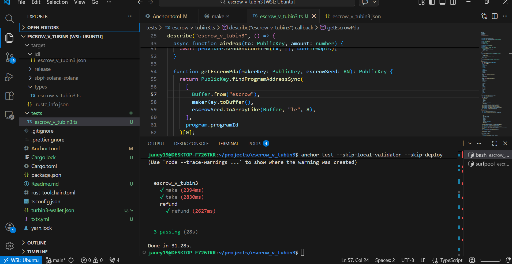

# Escrow V Tubin3

# Assignment completed

## Commands

### Build
```bash
anchor build
```

### Deploy
```bash
solana program deploy target/deploy/escrow_v_tubin3.so
```

### Test
```bash
anchor test --skip-local-validator --skip-deploy
```

## Tests Passing


